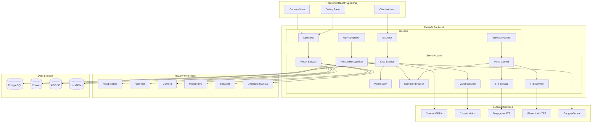
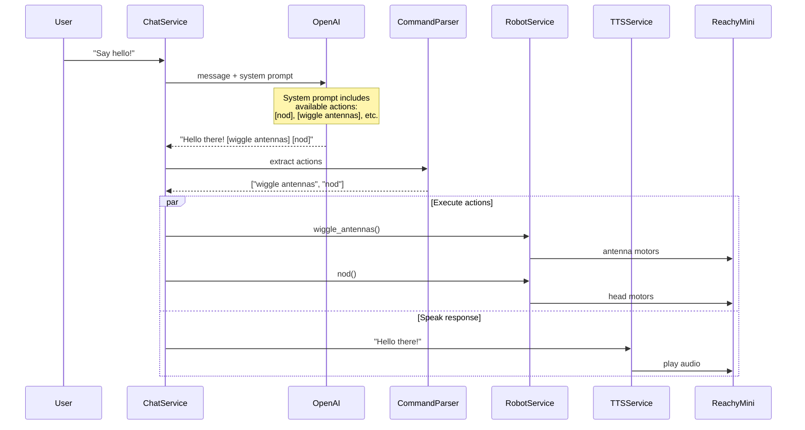
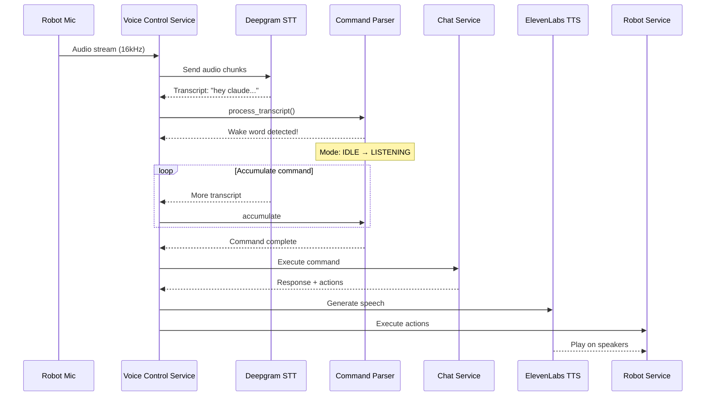

# Codebase Map

> Auto-generated by Cartographer. Last mapped: 2026-02-02

## System Overview



## AI-Robot Integration Flow

The core innovation is how AI chat responses control physical robot actions:



## Voice Command Flow



## Directory Structure

```
network-school-robot/
├── backend/
│   ├── app/
│   │   ├── main.py              # FastAPI app entry point
│   │   ├── config.py            # Settings (Pydantic)
│   │   ├── database.py          # PostgreSQL connection
│   │   ├── models/              # SQLAlchemy models
│   │   │   ├── conversation.py  # Chat history model
│   │   │   └── robot_log.py     # Robot log model
│   │   ├── routers/             # API endpoints
│   │   │   ├── chat.py          # /api/chat/*
│   │   │   ├── robot.py         # /api/robot/*
│   │   │   ├── voice_control.py # /api/voice-control/*
│   │   │   ├── personality.py   # /api/personality/*
│   │   │   ├── recognition.py   # /api/recognition/*
│   │   │   ├── storage.py       # /api/storage/*
│   │   │   ├── tokens.py        # /api/tokens/*
│   │   │   └── logs.py          # /api/logs/*
│   │   ├── services/            # Business logic
│   │   │   ├── robot_service.py        # Reachy Mini control (7442 tokens)
│   │   │   ├── chat_service.py         # AI chat orchestration
│   │   │   ├── personality_service.py  # 8 AI personalities
│   │   │   ├── command_parser_service.py # Wake word + action parsing
│   │   │   ├── voice_control_service.py  # Voice control orchestrator
│   │   │   ├── voice_tracking_service.py # Live head tracking
│   │   │   ├── stt_service.py          # Deepgram integration
│   │   │   ├── tts_service.py          # ElevenLabs integration
│   │   │   ├── vision_service.py       # Claude vision analysis
│   │   │   ├── person_recognition_service.py # Face detection + ID
│   │   │   ├── video_stream_service.py # Camera streaming
│   │   │   ├── claude_code_service.py  # Claude Code CLI execution
│   │   │   ├── convex_service.py       # Convex database
│   │   │   ├── storage_service.py      # AWS S3
│   │   │   └── token_service.py        # Gamification tokens
│   │   └── websocket/
│   │       └── manager.py       # WebSocket connection manager
│   ├── data/
│   │   ├── faces/               # Person recognition data
│   │   └── tokens/              # Token balances/transactions
│   ├── requirements.txt
│   ├── start.sh                 # GStreamer-configured launcher
│   └── .env.example
├── frontend/
│   ├── src/
│   │   ├── App.tsx              # Main application
│   │   ├── components/
│   │   │   ├── ChatInterface.tsx      # Chat UI
│   │   │   ├── CameraView.tsx         # Live camera
│   │   │   ├── RobotStatus.tsx        # Status display
│   │   │   ├── DebugPanel.tsx         # Direct commands
│   │   │   ├── LogViewer.tsx          # Real-time logs
│   │   │   └── ConnectionIndicator.tsx
│   │   ├── hooks/
│   │   │   ├── useRobotStatus.ts
│   │   │   └── useWebSocket.ts
│   │   ├── services/
│   │   │   └── api.ts           # REST API client
│   │   └── types/
│   │       └── index.ts         # TypeScript types
│   └── package.json
├── docs/
│   ├── SETUP.md                 # Setup guide
│   ├── REACHY_MINI_SETUP.md     # Robot-specific setup
│   ├── ARCHITECTURE.md          # System architecture
│   └── CHANGELOG.md
├── docker-compose.yml           # PostgreSQL
└── CLAUDE.md                    # Project context
```

## Module Guide

### Core Services

#### Robot Service (`backend/app/services/robot_service.py`)

**Purpose:** Primary interface to Reachy Mini hardware via SDK

**Key APIs:**
| Function | Description |
|----------|-------------|
| `connect()` | Initialize robot (WebRTC or fallback) |
| `move_head(x, y, z, roll)` | Position head |
| `move_antennas(left, right)` | Control antennas |
| `express_emotion(emotion)` | Compound movements |
| `capture_image()` | Camera snapshot |
| `execute_action(action)` | Text-based action execution |

**Dependencies:** reachy_mini SDK, numpy, httpx
**Dependents:** chat_service, voice_control_service, routers/robot

**Key Insight:** Auto-starts voice tracking on connect for natural interaction.

---

#### Chat Service (`backend/app/services/chat_service.py`)

**Purpose:** AI conversation orchestration with action extraction

**Key APIs:**
| Function | Description |
|----------|-------------|
| `chat(message)` | Sync chat |
| `chat_stream(message)` | Streaming response |
| `set_personality(type)` | Change AI persona |
| `_extract_actions(text)` | Parse `[action]` brackets |

**Action Pattern:** `\[([^\]]+)\]` extracts bracketed actions

**Camera Triggers:**
```python
["take a picture", "what do you see", "look at this",
 "can you see", "describe what you see", "capture"]
```

**Dependencies:** openai, robot_service, vision_service, personality_service, tts_service

---

#### Personality Service (`backend/app/services/personality_service.py`)

**Purpose:** Multiple AI personalities with distinct behaviors

| Personality | Voice | Temp | Style |
|-------------|-------|------|-------|
| TARS | onyx | 0.8 | Dry wit, honest |
| Samantha | nova | 0.9 | Warm, empathetic |
| JARVIS | echo | 0.7 | Professional, British |
| Coach | alloy | 0.7 | Motivational |
| Teacher | nova | 0.6 | Educational |
| Friend | shimmer | 0.8 | Casual |
| Expert | onyx | 0.5 | Technical |
| Therapist | nova | 0.7 | Compassionate |

---

#### Command Parser Service (`backend/app/services/command_parser_service.py`)

**Purpose:** Wake word detection and command routing

**Voice Modes:** IDLE → LISTENING → PROCESSING

**Wake Words:** `hey claude`, `claude code`, `claude`

**Command Routing:** Code-related keywords → Claude Code CLI, else → Chat

```python
code_keywords = ["create", "write", "file", "script", "git", "deploy", ...]
```

---

#### Voice Control Service (`backend/app/services/voice_control_service.py`)

**Purpose:** Main orchestrator: STT → parsing → execution → TTS

**States:** STOPPED → STARTING → RUNNING → PROCESSING → SPEAKING

**Audio Config:** 16kHz, 16-bit PCM, 50ms chunks

---

### AI Integrations

| Service | Provider | Purpose |
|---------|----------|---------|
| Chat | OpenAI GPT-4o-mini | Conversation |
| Vision | Anthropic Claude Sonnet | Image analysis |
| STT | Deepgram Nova-2 | Speech-to-text |
| TTS | ElevenLabs | Text-to-speech |
| Recognition | Google Gemini 2.0 | Person identification |

---

### Data Storage

| Store | Purpose | Location |
|-------|---------|----------|
| PostgreSQL | Logs, conversations | Docker (port 5433) |
| Convex | Real-time messages | Cloud |
| AWS S3 | Photos, videos, audio | Cloud |
| Local files | Faces, tokens | `backend/data/` |

---

## API Reference

### Robot Control (`/api/robot/`)

```
GET  /status                 # Connection status
POST /connect                # Connect to robot
POST /disconnect             # Disconnect
POST /action                 # Execute text action
POST /head/move              # Move head {x, y, z, roll}
POST /antennas/wiggle        # Wiggle antennas
POST /emotion                # Express emotion
POST /camera/capture         # Take picture
WS   /video-stream/ws        # Live camera stream
```

### Chat (`/api/chat/`)

```
POST /send                   # Sync message
POST /stream                 # Streaming message
POST /conversation           # Full flow (connect + actions)
GET  /history                # Chat history
```

### Voice (`/api/voice-control/`)

```
GET  /status                 # Voice control status
POST /start                  # Start listening
POST /stop                   # Stop listening
```

---

## Configuration Reference

### Essential Environment Variables

```bash
# Robot
ROBOT_HOST=reachy-mini.local
ROBOT_CONNECTION_MODE=network  # auto|network|localhost_only|simulation
ROBOT_AUTO_CONNECT=true

# AI Services (Required)
OPENAI_API_KEY=sk-...
DEEPGRAM_API_KEY=...

# AI Services (Optional)
ANTHROPIC_API_KEY=sk-ant-...   # Vision
ELEVENLABS_API_KEY=...          # TTS
GEMINI_API_KEY=...              # Person recognition

# Voice Control
VOICE_CONTROL_ENABLED=true
VOICE_CONTROL_WAKE_WORDS=hey claude,claude code,claude

# Personality
DEFAULT_PERSONALITY=tars
```

---

## Conventions

### Action Syntax

AI responses use bracketed actions:
```
"Hello! [wiggle antennas] [nod]"
```

Extracted via regex: `\[([^\]]+)\]`

### Available Actions

- Head: `nod`, `shake head`, `tilt head`, `look up/down/left/right`
- Antennas: `wiggle antennas`, `raise antennas`, `lower antennas`
- Camera: `take picture`, `capture`
- Emotions: `happy`, `sad`, `curious`, `surprised`, `confused`

### Service Pattern

All services are singletons instantiated at module level:
```python
# At end of service file
robot_service = RobotService()
chat_service = ChatService()
```

---

## Gotchas

1. **GStreamer on macOS:** Must set `DYLD_LIBRARY_PATH` before importing gi. Use `start.sh` or set manually.

2. **Robot `ready: false`:** Normal state - means backend is running but not fully initialized. Robot still responds to commands.

3. **Wake word sensitivity:** "claude" alone may trigger accidentally. Use "hey claude" for reliable activation.

4. **Camera fallback:** WebRTC camera may fail on macOS. Falls back to SSH-based capture automatically.

5. **Robot SSH credentials:** Default `pollen:root` - hardcoded in robot_service.py.

6. **Claude Code permissions:** Uses `--dangerously-skip-permissions` for non-interactive mode.

---

## Navigation Guide

**To add a new robot action:**
1. Add method to `backend/app/services/robot_service.py`
2. Add case to `execute_action()` method (line ~680)
3. Add endpoint to `backend/app/routers/robot.py` if needed

**To add a new AI personality:**
1. Add to `PERSONALITIES` dict in `backend/app/services/personality_service.py`
2. Include: name, voice, temperature, system_prompt

**To add a new API endpoint:**
1. Create router file in `backend/app/routers/`
2. Register in `backend/app/main.py`

**To modify voice wake words:**
1. Edit `VOICE_CONTROL_WAKE_WORDS` in `.env`
2. Or modify `command_parser_service.py` line ~30

**To add new camera trigger phrases:**
1. Edit `CAMERA_TRIGGERS` list in `chat_service.py` line ~24

---

## Token Budget

| Module | Tokens |
|--------|--------|
| robot_service.py | 7,442 |
| personality_service.py | 3,066 |
| voice_control_service.py | 3,218 |
| chat_service.py | 2,514 |
| command_parser_service.py | 2,032 |
| person_recognition_service.py | 2,462 |
| Frontend components | ~15,000 |
| **Total** | **82,981** |
